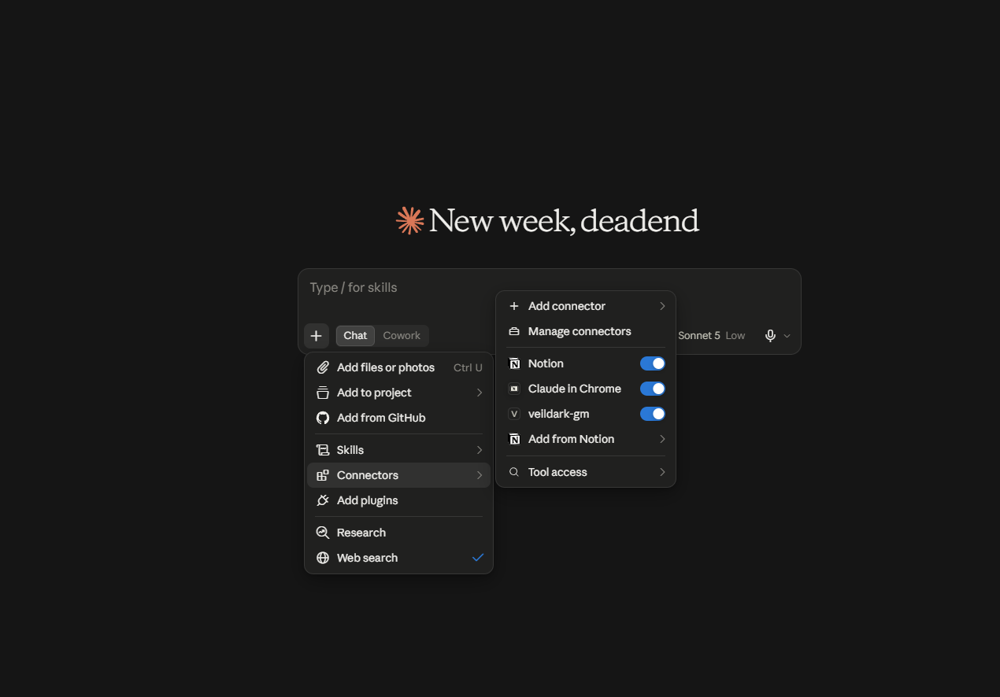
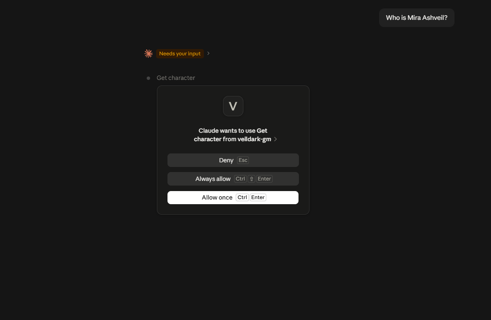

# Veildark Game Master

An AI Game Master that ingests any game world's lore PDF and lets players — or game engines — converse with it in real time. Built on a two-stage RAG pipeline with CrossEncoder reranking, exposed as a Gradio UI, FastAPI REST endpoint, and MCP server callable by Claude Desktop.

> *"You stand at the edge of a dying world. The Bleed grows. Ask your questions, traveller — if you dare."*

---

## Demo

**[Try it live](https://huggingface.co/spaces/GamedevDeadend/Veildark-game-master)** — HuggingFace Space | **[Watch the demo](https://www.loom.com/share/335602b65faf43c795303990177c15f9)** — Loom walkthrough

### MCP Integration — Claude Desktop

The Game Master runs as a local MCP server, exposing 5 specialized lore tools directly inside Claude Desktop.

**Connector active:**



**Permission request — Claude calling `get_character` tool:**



**Response — "Who is Mira Ashveil?":**


---

## What it does

- **Two-stage RAG pipeline** — ChromaDB retrieves top 20 chunks, CrossEncoder reranks to top 5. Better relevance than basic vector search alone
- **MCP server** — 5 specialized lore tools callable by Claude Desktop or any MCP-compatible client
- **FastAPI REST endpoint** — streamable `/ask` endpoint, callable by game engines (Unreal, Unity) over HTTP
- **Gradio UI** — browser chat interface with streaming responses and dark fantasy theming
- **Persistent embeddings** — ChromaDB caches embeddings on first run, skips re-embedding on subsequent runs
- **Conversation memory** — maintains chat history across the session
- **Bring your own lore** — swap the PDF, delete the cache, re-run. Works with any game world

---

## Tech Stack

| Component | Technology |
|-----------|-----------|
| LLM | Groq API — `openai/gpt-oss-20b` |
| Embeddings | HuggingFace — `all-MiniLM-L6-v2` |
| Reranking | CrossEncoder — `ms-marco-MiniLM-L-6-v2` |
| Vector Store | ChromaDB (persistent) |
| PDF Loading | PyMuPDF |
| RAG Framework | LangChain |
| REST API | FastAPI + Uvicorn |
| UI | Gradio |
| MCP Server | FastMCP |

---

## Architecture

```
Player / Game Engine / AI Client
            ↓
┌─────────────────────────────────┐
│         Interface Layer         │
│  Gradio UI │ FastAPI │ MCP      │
└─────────────┬───────────────────┘
              ↓
┌─────────────────────────────────┐
│           gm_agent.py           │
│  RAG retrieval + LLM + memory   │
└──────┬──────────────┬───────────┘
       ↓              ↓
┌──────────────┐ ┌────────────────┐
│  gm_rag.py   │ │  gm_llm.py     │
│  ChromaDB    │ │  Groq LLM      │
│  CrossEncoder│ │                │
│  PyMuPDF     │ │                │
└──────────────┘ └────────────────┘
```

**Two-stage RAG:**
1. ChromaDB similarity search → top 20 chunks
2. CrossEncoder reranking → top 5 by relevance score

Same core logic powers all three interfaces — Gradio, FastAPI, and MCP.

---

## Project Structure

```
GameMaster/
├── core/
│   ├── gm_llm.py          # LLM initialization (Groq)
│   ├── gm_rag.py          # RAG pipeline + reranking
│   └── gm_agent.py        # Orchestrates RAG + LLM + memory
├── api/
│   └── gm_api.py          # FastAPI REST endpoint (/ask, /health)
├── ui/
│   └── gm_ui.py           # Gradio chat interface
├── gm_mcp/
│   └── gm_mcp_server.py   # MCP server — 5 lore tools
├── resources/
│   └── GameLore_Resource.pdf
├── main.py                # Entry point — mode switching via argparse
└── .env                   # API keys (not committed)
```

---

## Getting Started

**Prerequisites:** Python 3.9+, Groq API key ([console.groq.com](https://console.groq.com)), HuggingFace token

```bash
git clone https://github.com/GamedevDeadend/GameMaster.git
cd GameMaster

python -m venv .venv
.venv\Scripts\activate          # Windows CMD
# .venv\Scripts\Activate.ps1   # Windows PowerShell
# source .venv/bin/activate     # Mac/Linux

pip install -r requirements.txt
```

Create a `.env` file:

```env
GROQ_API_KEY=your_groq_api_key_here
HF_TOKEN=your_huggingface_token_here
```

Run:

```bash
python main.py --mode gradio      # Browser UI
python main.py --mode fastapi     # REST API
python main.py --mode mcp_local   # MCP server (Claude Desktop)
python main.py --mode mcp_remote  # MCP server (HTTP, production)
```

First run embeds the lore PDF and caches it. Subsequent runs load from cache instantly.

---

## Interfaces

### Gradio UI

```
http://127.0.0.1:7860
```

### FastAPI REST

```
http://127.0.0.1:8000/docs
```

**POST** `/ask`
```json
{ "query": "Who is Mira Ashveil?" }
```

Streams response in real time. Game engines can call this over HTTP:

```cpp
// Unreal Engine example
FHttpModule::Get().CreateRequest()
    ->SetURL("http://your-server/ask")
    ->SetVerb("POST")
    ->SetContentAsString("{\"query\": \"Describe the Ashwall\"}")
    ->ProcessRequest();
```

### MCP Server — 5 Tools

| Tool | Description |
|------|-------------|
| `search_lore(query)` | General RAG search across entire lore |
| `get_character(name)` | Character details, backstory, relationships |
| `get_faction(name)` | Faction goals, leadership, territory |
| `get_location(name)` | Location geography, history, significance |
| `narrate(situation)` | Dramatic in-world scene narration |

**Claude Desktop config:**

```json
{
  "mcpServers": {
    "veildark-gm": {
      "command": "path/to/.venv/Scripts/python.exe",
      "args": ["path/to/GameMaster/main.py", "--mode", "mcp_local"],
      "env": {
        "GROQ_API_KEY": "your_key_here",
        "HF_TOKEN": "your_token_here"
      }
    }
  }
}
```

See [MCP documentation](https://modelcontextprotocol.io/docs/2026-07-28/develop/connect-local-servers) for full setup guide.

---

## The World — Veildark

The default lore is **Veildark** — a dark fantasy world:

- A dying world torn open by **The Bleed** — a wound in reality through which shadow creatures pour
- **1,200 years of war** against the Veilborn, with humanity retreating behind the Ashwall
- 5 major factions, 5 key characters, a full magic system (Veilcraft), and unresolved mysteries

This works with **any game world lore** — swap the PDF, delete `resources/embeddings/`, re-run.

---

## Known Limitations

- Single shared conversation history — no multi-user session support
- MCP tools use prompt-based differentiation — metadata filtering per tool is planned for v2
- No error handling on malformed PDFs

---

## Planned

- [ ] Session management for multiple simultaneous players
- [ ] Metadata-based MCP tool filtering (character/faction/location chunks tagged at ingestion)
- [ ] TTS voice output
- [ ] Game engine integration demo (Unreal HTTP blueprint)
- [ ] Docker setup

---

## License

MIT License — free to use, modify, and build upon.

---

*Built by [GamedevDeadend](https://github.com/GamedevDeadend) — Game Developer turned AI Engineer*
- GitHub: [@GamedevDeadend](https://github.com/GamedevDeadend)
- LinkedIn: [Tanmay Agrawal](https://www.linkedin.com/in/tanmay-agrawal-2954361a0/)